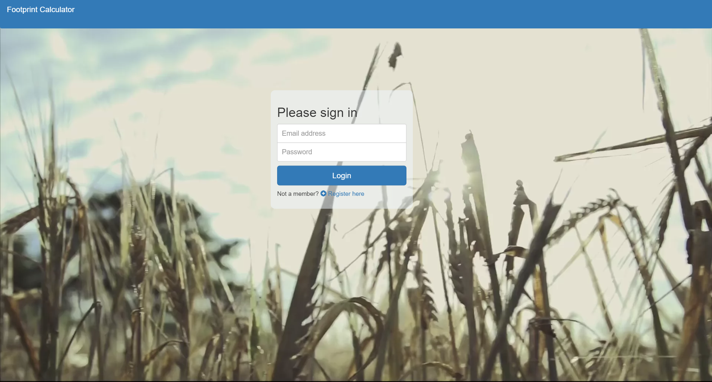
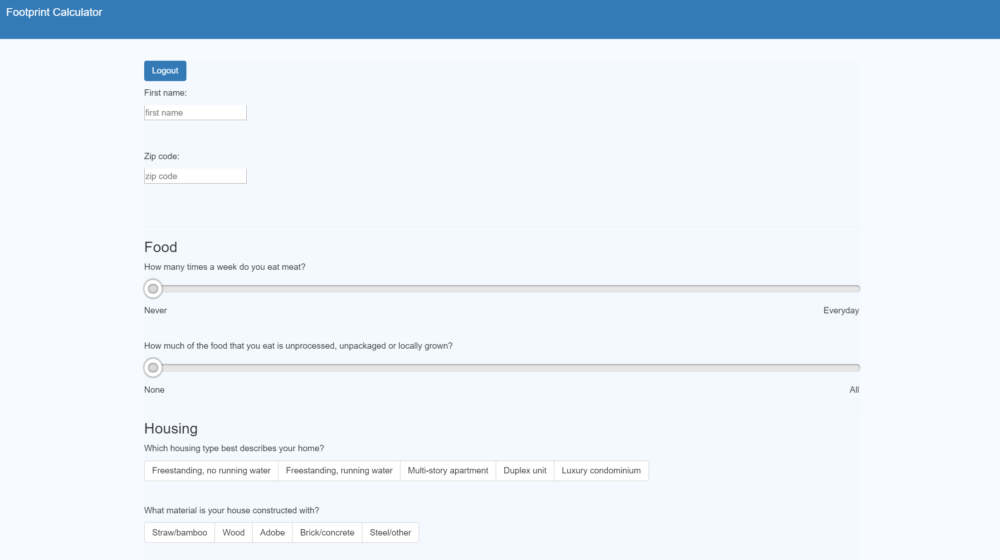

# Footprint

Footprint is a simple survey you can take to see your effect on the environment compared to other users.

## Getting Started

Open up the [project link](https://infinite-badlands-27209.herokuapp.com/login) and you should be able to registor or login.

After you are logged in, you must answer all the questions provided in the survey.

After submitting your survey, you will get your results compared to other users who have taken the same survey.

## Running Footprint Locally

To run this source code:

* Clone this repo
* Run MongoDB server. We run `mongod` in the terminal and use Robo 3T to see our database.
* Run `npm start` or `yarn start`

## Built With

* HTML5

* CSS

* [Javascript](https://www.javascript.com/)

* [BootstrapCDN v3.3.7](http://getbootstrap.com)

* [MongoDB](http://mongodb.github.io/node-mongodb-native/3.1/) - Database to store and retreive user answers

* [Express js](https://expressjs.com/) - Node application library

* [React.js](https://reactjs.org/) - Component based JavaScript library

* [Node](https://nodejs.org/en/) - Run JavaScript's backend loacally 

* [Mongoose](http://mongoosejs.com/) - Modeling for MongoDB 

* [Heroku](https://www.heroku.com/) - Deployed on Heroku

* [Passport](http://www.passportjs.org/docs/authenticate/) - login and register authentication

* [Chart.js](https://www.chartjs.org/) - creating graphs on the results page

## Future Features

In the future, we hope to incorporate the following features:

* Carbon Footprint APIs to give users a number they can improve on

* Stripe or Paypal for donations to non-profits focusing on the environment 

* D3 or Chartio to display data visualizations and infographs of user results

* API or calculate ways users can alleviate high carbon footprint

* Allow social media sharing of user results

## Inspiration

* [Footprint Calculator](http://www.footprintcalculator.org/)

* [Berkley Carbon Footprint Calculator](http://coolclimate.berkeley.edu/carboncalculator)

## Authors

* **Jessica Brush**  - [dandiflower](https://github.com/dandiflower)

* **Hannah Lim** - [hannahlim213](https://github.com/hannahlim213)

## License

This project is licensed under the MIT License - see the [LICENSE.md](LICENSE.md) file for details
