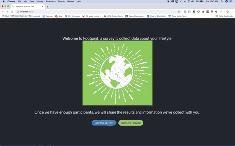

# Footprint
<h1 align="center">
  </a>
</h1>

<h3 align="center">:herb: Take a survey and see live results </h3>


* [Launch app and take the survey!](https://infinite-badlands-27209.herokuapp.com)

<h1 align="center">
  </a>
</h1>


## Inspiration

* [Footprint Calculator](http://www.footprintcalculator.org/)

* [Berkley Carbon Footprint Calculator](http://coolclimate.berkeley.edu/carboncalculator)


## To run this source code:

* Clone this repo and install dependencies by running
```
npm i
```
or
```
yarn install
```
* After the dependencies are installed, run
```
npm start
```
or 
```
yarn start
```

## Built With:

* HTML5

* CSS

* [React.js](https://reactjs.org/) - Component based JavaScript library

* [Javascript](https://www.javascript.com/)

* [Typeform](https://www.typeform.com/) - Typeform to create beautiful interactive surveys

* [Bootstrap](http://getbootstrap.com)

* [Heroku](https://www.heroku.com/) - Deployed on Heroku

* see package.json for additional packages

## Future Features

In the future, we hope to incorporate the following features:

* Authorization for users to save results

* Carbon Footprint APIs to give users a number they can improve on

* Stripe or Paypal for donations to non-profits focusing on the environment 

* D3 or Chartio to display data visualizations and infographs of user results

* API or calculate ways users can alleviate high carbon footprint

* Allow social media sharing of user results

## References

* [Chartjs React](https://github.com/bradtraversy/reactcharts/blob/master/src/components/Chart.js)

## Authors 🖋

* **Hannah Lim** [Hannah Lim](https://github.com/hannahlim213)
* **Jessica Brush** [Jessica Brush](https://github.com/dandiflower)


## Acknowledgments 🗣

* A big thank you to our instructors and TA's at Berkeley's Coding bootcamp!! Thank you Jerome, Amber, Sasha, Ricky and Dani!


## License

This project is licensed under the MIT License.
