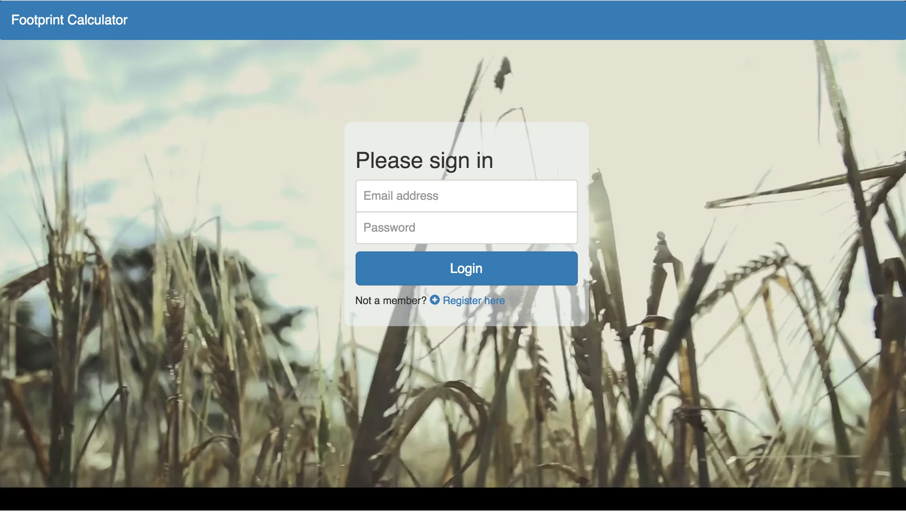
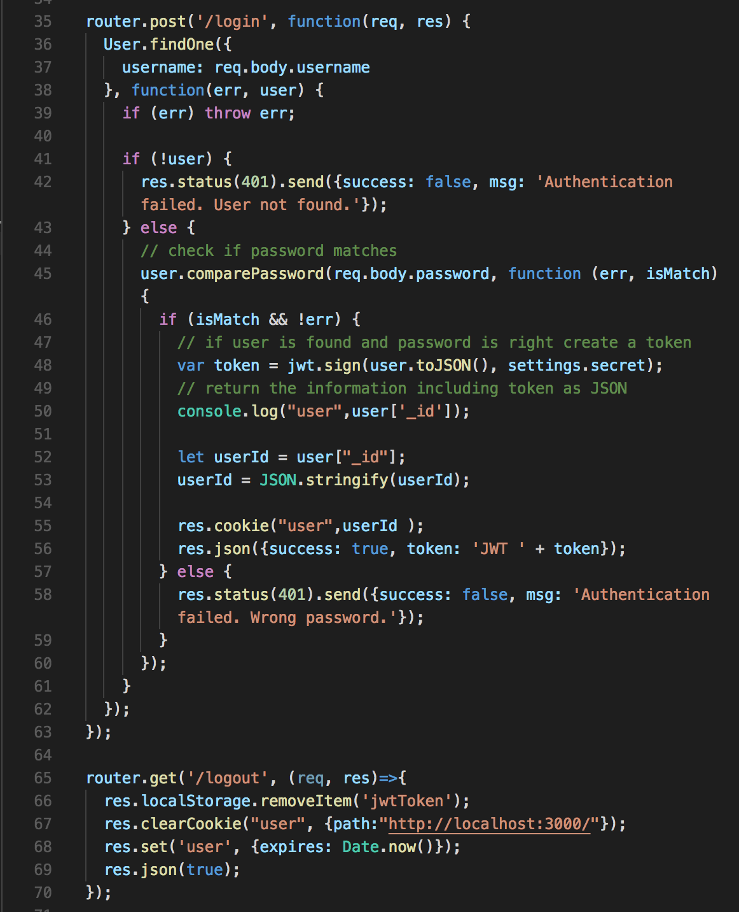

# Footprint

Footprint is a React application which easily calculates a user's eco-footprint based on the user's lifestyle. People can learn how to reduce their footprint by taking the quiz and seeing how they compare to the average.

## Use the app:
* [Launch app](https://infinite-badlands-27209.herokuapp.com)



## To run this source code:

* Make sure MongoDB server is running
* Run 'yarn run build' & then 'yarn start'

## Built With:

* React
* Passport
* Concurrently
* Express
* Mongoose
* React Chart.js 2
* see package.json for additional packages

## Code examples

* **Passport** - User authentification:

```

```

* **Session Storage** - Creating User Session (using jQuery click event):
```
router.get('/logout', (req, res)=>{
  res.localStorage.removeItem('jwtToken');
  res.clearCookie("user", {path:"http://localhost:3000/"});
  res.set('user', {expires: Date.now()});
  res.json(true);
});
```

## Authors 🖋

* **Hannah Lim** [Hannah Lim](https://github.com/hannahlim213)
* **Jessica Brush** [Jessica Brush](https://github.com/dandiflower)

## Acknowledgments 🗣

* **A big thank you to our instructors and TA's at Berkeley's Coding bootcamp!!
